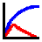

<p align="center">
  
</p>

**CAPRA-ROBOT** is a comprehensive software suite for catastrophe risk modelling and probabilistic risk assessment, developed by **INGENIAR CAD/CAE Ltd.**

The suite comprises a collection of specialized software applications covering hazard assessment, climate modelling, vulnerability analysis, loss estimation, probabilistic risk calculation, and supporting data-management processes.

Each application is developed, versioned, and released independently. Applications can therefore be downloaded and updated separately through their corresponding release pages.

CAPRA-ROBOT applications are distributed free of charge as proprietary, closed-source software under the terms of the **CAPRA-ROBOT Freeware License**.

---

## Software Catalog

| <div align="center">Application</div> |  | Domain | Description | Current Version | Release |
|:---:|:---|---|---|:---:|:---:|
|  | **Strong Motion Analyst (SMA)** | **Seismic Hazard** | Processing and analysis of seismological and seismic strong-motion data. | **1.4.0** | [View release](https://github.com/ingeniarrisk/CAPRA-ROBOT/releases/tag/SMA-v1.4.0) |
|  | **Seismic Microzonation Studio (SMS)** | **Seismic Hazard** | Evaluation of local site effects, dynamic soil response, and seismic microzonation within complete geological environments. | **1.2.0** | [View release](https://github.com/ingeniarrisk/CAPRA-ROBOT/releases/tag/SMS-v1.2.0) |
|  | **Drought Pro** | **Climate Modelling, Drought and Wildfire Hazard** | Modelling of meteorological time series, agricultural drought, and wildfire hazard. | **1.5.0** | [View release](https://github.com/ingeniarrisk/CAPRA-ROBOT/releases/tag/DroughtPro-v1.5.0) |
|  | **Tropical Cyclone Hazard Modeler (TCHM)** | **Tropical Cyclone Hazard** | Probabilistic tropical cyclone hazard modelling, including wind fields, storm surge, and rainfall. | **1.0.2** | [View release](https://github.com/ingeniarrisk/CAPRA-ROBOT/releases/tag/TCHM-v1.0.2) |
|  | **Volcanic Hazard Analysis and Simulation Tool (VHAST)** | **Volcanic Hazard** | Probabilistic volcanic hazard modelling for ashfall, lahars, pyroclastic flows, ballistic projectiles, and lava flows. | **3.0.0** | [View release](https://github.com/ingeniarrisk/CAPRA-ROBOT/releases/tag/VHAST-v3.0.0) |
|  | **Landslide Hazard Mapper (LHM)** | **Landslide Hazard** | Probabilistic landslide hazard modelling using neural-network-based methods. | **VERSION** | [View release](RELEASE_LINK) |
|  | **Flooding Analyst** | **Flood Hazard** | Probabilistic flood hazard modelling integrating hydrological analysis and hydraulic modelling with HEC-RAS 5. | **VERSION** | [View release](RELEASE_LINK) |
|  | **Vulnerability Studio** | **Vulnerability Modelling** | Development of vulnerability functions for buildings and infrastructure systems. | **VERSION** | [View release](RELEASE_LINK) |
|  | **RiskOne** | **Risk Assessment** | CAPRA-ROBOT computational engine for probabilistic catastrophe risk assessment and loss calculation. | **VERSION** | [View release](RELEASE_LINK) |
|  | **FileCAT** | **File and Data Management** | Supporting tool for managing files, datasets, and information structures used by the CAPRA-ROBOT platform. | **VERSION** | [View release](RELEASE_LINK) |


---

## Software Domains

CAPRA-ROBOT supports multiple components of the catastrophe risk modelling process.

### Hazard Assessment

The suite includes specialized applications for evaluating:

- Seismic hazard
- Local site effects and seismic microzonation
- Climate variability and meteorological time series
- Drought hazard
- Wildfire hazard
- Tropical cyclone hazard
- Wind hazard
- Storm surge
- Tropical cyclone rainfall
- Volcanic hazard
- Landslide hazard
- Flood hazard

### Vulnerability Modelling

CAPRA-ROBOT includes tools for developing vulnerability functions for buildings, infrastructure systems, and other exposed assets.

### Probabilistic Risk Assessment

The suite includes computational tools for estimating physical damage, economic losses, exceedance probability curves, average annual losses, probable maximum losses, and other catastrophe risk metrics.

### Supporting Tools

Additional applications support file administration, data preparation, and the management of information used throughout the modelling process.

---

## Applications

### Strong Motion Analyst (SMA)

**Strong Motion Analyst** is a software application for processing and analyzing seismological and seismic strong-motion data.

It provides tools for the visualization, processing, interpretation, and analysis of earthquake records and associated ground-motion parameters.

**Domain:** Seismic Hazard  
**Current version:** 1.4.0  
**Platform:** Microsoft Windows 10 and Windows 11

[**View Strong Motion Analyst release**](https://github.com/ingeniarrisk/CAPRA-ROBOT/releases/tag/SMA-v1.4.0)

---

### Seismic Microzonation Studio (SMS)

**Seismic Microzonation Studio** is a software application for modelling the dynamic response of soil deposits within complete geological environments.

It supports the evaluation of local site effects, dynamic soil response, and seismic microzonation.

**Domain:** Seismic Hazard  
**Current version:** 1.2.0  
**Platform:** Microsoft Windows 10 and Windows 11

[**View Seismic Microzonation Studio release**](https://github.com/ingeniarrisk/CAPRA-ROBOT/releases/tag/SMS-v1.2.0)

---

### Drought Pro

**Drought Pro** is a software application for modelling meteorological time series, agricultural drought, and wildfire hazard.

It supports the processing and simulation of climate information and the probabilistic assessment of drought and wildfire-related conditions.

**Domain:** Climate Modelling, Drought and Wildfire Hazard  
**Current version:** 1.5.0  
**Platform:** Microsoft Windows

[**View Drought Pro release**](https://github.com/ingeniarrisk/CAPRA-ROBOT/releases/tag/DroughtPro-v1.5.0)

---

### Tropical Cyclone Hazard Modeler (TCHM)

**Tropical Cyclone Hazard Modeler** is a software application for probabilistic tropical cyclone hazard modelling.

The application supports the simulation and assessment of the principal physical effects associated with tropical cyclones, including:

- Wind fields
- Storm surge
- Tropical cyclone rainfall

It can be used to generate probabilistic hazard information for catastrophe risk assessment, engineering analysis, and disaster risk management applications.

**Domain:** Tropical Cyclone Hazard  
**Current version:** 1.0.2  
**Platform:** Microsoft Windows

[**View Tropical Cyclone Hazard Modeler release**](https://github.com/ingeniarrisk/CAPRA-ROBOT/releases/tag/TCHM-v1.0.2)

---

### Volcanic Hazard Analysis and Simulation Tool (VHAST)

**Volcanic Hazard Analysis and Simulation Tool** is a software application for probabilistic volcanic hazard modelling.

The application supports the assessment of:

- Volcanic ashfall
- Lahars
- Pyroclastic flows
- Ballistic projectiles
- Lava flows

**Domain:** Volcanic Hazard  
**Current version:** 3.0.0  
**Platform:** Microsoft Windows

[**View VHAST release**](https://github.com/ingeniarrisk/CAPRA-ROBOT/releases/tag/VHAST-v3.0.0)

---

### Landslide Hazard Mapper (LHM)

**Landslide Hazard Mapper** is a software application for probabilistic landslide hazard modelling using neural-network-based methods.

It supports the identification and assessment of landslide susceptibility and hazard over large geographical areas.

**Domain:** Landslide Hazard  
**Current version:** VERSION  
**Platform:** Microsoft Windows

[**View Landslide Hazard Mapper release**](RELEASE_LINK)

---

### Flooding Analyst

**Flooding Analyst** is a software application for probabilistic flood hazard modelling.

The application includes a hydrological analysis module and hydraulic modelling capabilities integrated with **HEC-RAS 5**.

**Domain:** Flood Hazard  
**Current version:** VERSION  
**Platform:** Microsoft Windows

[**View Flooding Analyst release**](RELEASE_LINK)

---

### Vulnerability Studio

**Vulnerability Studio** is a software application for developing vulnerability functions for buildings and infrastructure systems.

It supports the definition, analysis, visualization, and implementation of physical vulnerability models used in catastrophe risk assessment.

**Domain:** Vulnerability Modelling  
**Current version:** VERSION  
**Platform:** Microsoft Windows

[**View Vulnerability Studio release**](RELEASE_LINK)

---

### RiskOne

**RiskOne** is the main catastrophe risk calculation engine of the CAPRA-ROBOT Software Suite.

It performs probabilistic risk calculations by integrating hazard, exposure, and vulnerability information to estimate physical damage and economic losses.

**Domain:** Risk Assessment  
**Current version:** VERSION  
**Platform:** Microsoft Windows

[**View RiskOne release**](RELEASE_LINK)

---

### FileCAT

**FileCAT** is a supporting application for managing files, datasets, and information structures used by the CAPRA-ROBOT platform.

It facilitates the administration, organization, and preparation of files required by different CAPRA-ROBOT applications.

**Domain:** File and Data Management  
**Current version:** VERSION  
**Platform:** Microsoft Windows

[**View FileCAT release**](RELEASE_LINK)

---

## Installation and System Requirements

CAPRA-ROBOT applications are distributed independently through the **Releases** section of this repository.

Unless otherwise specified in the corresponding release:

- Applications are designed for Microsoft Windows.
- Each application is distributed through its corresponding installer or software package.
- System requirements and software dependencies may vary between applications.
- Application-specific requirements are documented in the corresponding release notes.

Users are encouraged to download CAPRA-ROBOT applications only from this official repository or from other official distribution channels designated by INGENIAR CAD/CAE Ltd.

---

## Independent Versioning

Each CAPRA-ROBOT application follows its own development and versioning cycle.

Updating one application does not imply that the other applications in the suite have also been updated.

Release tags follow the general convention:

```text
APPLICATION-vMAJOR.MINOR.PATCH
